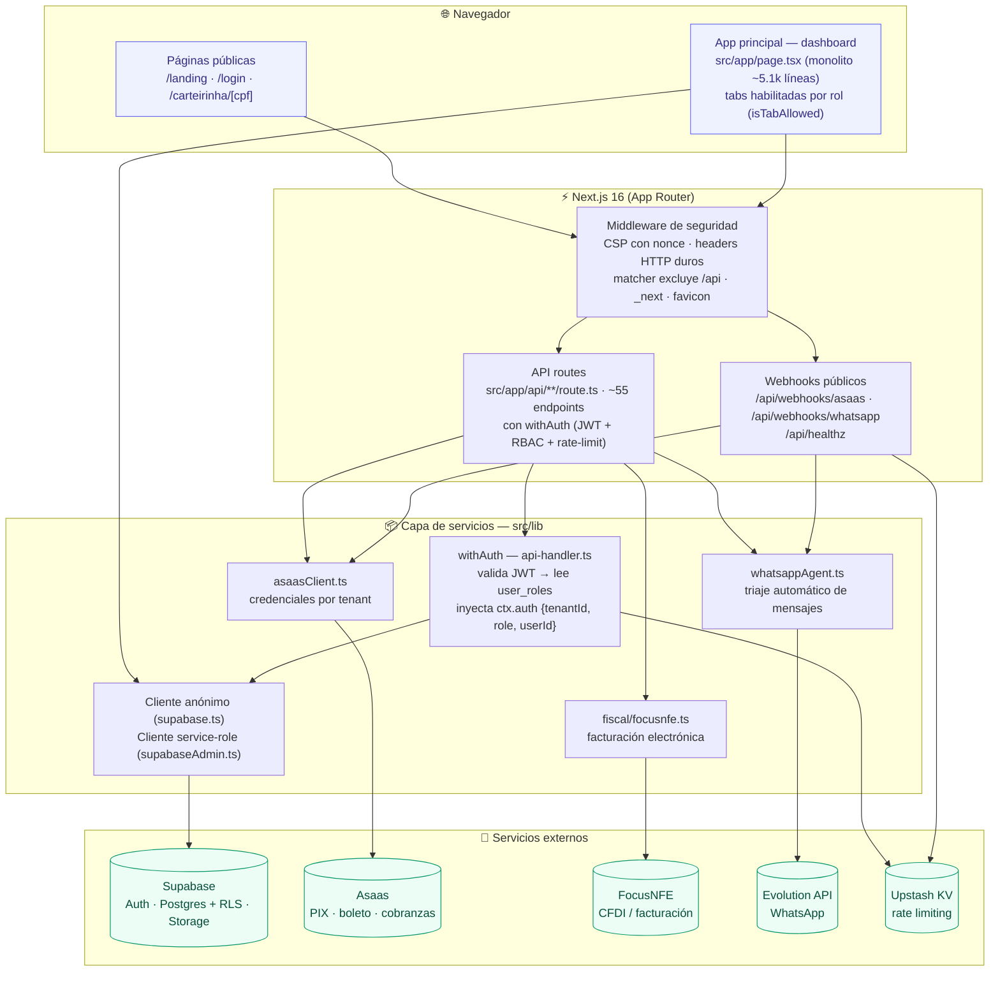
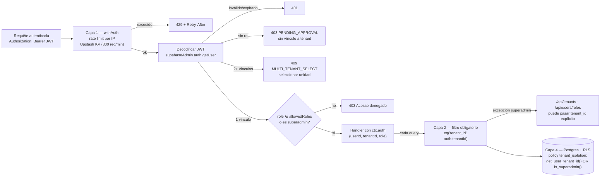
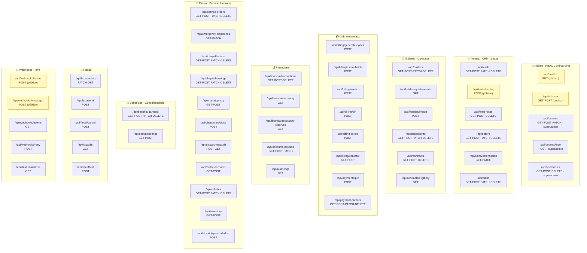
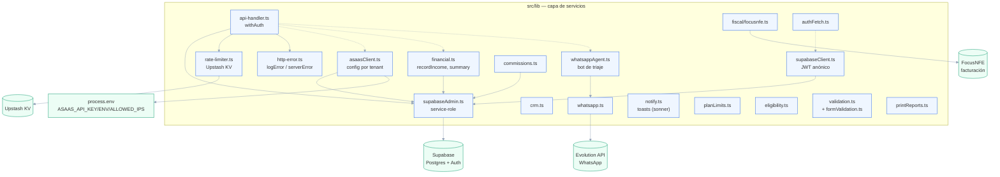
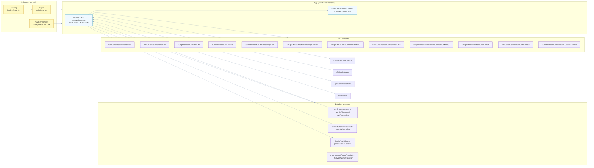
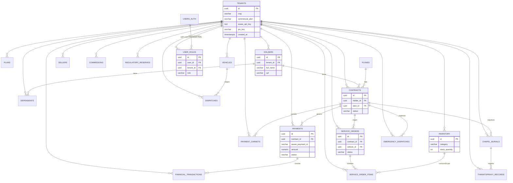
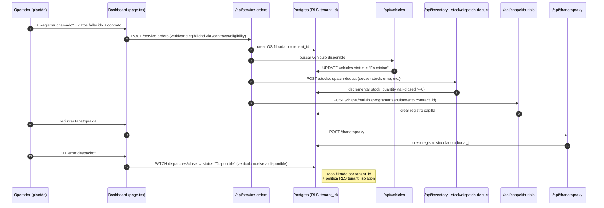
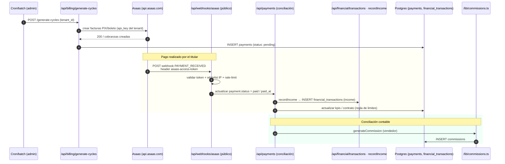

# 📊 EternitySOS — Graphify (mapa visual del proyecto)

> Generado con `graphify` sobre el repo `C:\Users\User\eternitysos`.
> Estado del código: commit `49f53a5` (2026-09-13). Next.js 16 · React 19 · Supabase · Asaas.
>
> 🎨 Para ver los diagramas: abre este archivo con la extensión
> **"Markdown Preview Mermaid"** de VS Code, o pega cada bloque en
> [mermaid.live](https://mermaid.live). En GitHub/Markdown que soporte
> Mermaid también renderizan.
>
> Complemento didáctico: [`ARQUITETURA-RBAC-MULTITENANT.md`](./ARQUITETURA-RBAC-MULTITENANT.md).

## 📑 Índice

1. [Vista general de arquitectura](#1-vista-general-de-arquitectura)
2. [Cadena de autenticación y las 4 capas de aislamiento](#2-cadena-de-autenticación-y-las-4-capas-de-aislamiento)
3. [Mapa de dominios → rutas API](#3-mapa-de-dominios--rutas-api)
4. [Capas de librerías (src/lib) y servicios](#4-capas-de-librerías-srclib-y-servicios)
5. [Frontend — páginas, componentes y contexto](#5-frontend--páginas-componentes-y-contexto)
6. [Modelo de datos (ERD)](#6-modelo-de-datos-erd)
7. [Flujo: atención de un óbito (plantão 24 h)](#7-flujo-atención-de-un-óbito-plantão-24-h)
8. [Flujo: cobranza y conciliación Asaas](#8-flujo-cobranza-y-conciliación-asaas)
9. [Anexo: mapa completo de rutas y cómo regenerar](#9-anexo-mapa-completo-de-rutas-y-cómo-regenerar)

---

## 1. Vista general de arquitectura



---

## 2. Cadena de autenticación y las 4 capas de aislamiento



**Las 4 capas de seguridad que evitan mezclar funerarias (multi-tenancy):**

| Capa | Dónde actúa | Qué hace |
|------|-------------|----------|
| 1. Middleware `withAuth` | Toda API | Decodifica el JWT y extrae `tenantId` + `role` del usuario |
| 2. Filtro obligatorio | Toda query | `.eq('tenant_id', auth.tenantId)` en cada SELECT/UPDATE/DELETE |
| 3. Excepción superadmin | `/api/tenants`, `/api/users/roles` | Solo superadmin puede pasar `tenant_id` ajeno |
| 4. RLS de Postgres | Base de datos | Bloquea en la BD aunque escape del código (fail-closed) |

---

## 3. Mapa de dominios → rutas API

El router de Next.js expone ~55 endpoints bajo `/api/*`. Todos pasan por
`withAuth` (JWT + RBAC + rate-limit) **excepto** los marcados como
**público**. La matriz de roles se resuelve en `src/config/permissions.ts`
y el 2.º argumento de `withAuth(..., ['roles'])` controla el acceso.



#### Tabla de referencia (ruta / métodos / notas)

| Ruta (`src/app/api`) | Métodos | Público / Auth | Notas |
|---|---|---|---|
| `/healthz` | GET | **Público** | Sin auth ni BD (uptime monitor) |
| `/init-user` | GET, POST | **Público** (con token) | Lee estado de rol del usuario logueado |
| `/webhooks/asaas` | POST | **Público** (token + whitelist IP) | Conciliación de pagos |
| `/webhooks/whatsapp` | POST | **Público** (token) | Webhook del agente de triaje |
| `/webhooks/events` | GET | Auth | Eventos internos / polling |
| `/webhooks/retry` | POST | Auth (admin) | Reintento manual de webhooks fallidos |
| `/tenants` (+ `/logo`) | GET, POST, PATCH | Auth (superadmin) | CRUD funerarias + cambio de plan |
| `/users/roles` | GET, POST, DELETE | Auth (superadmin) | Concesión/revocación de roles |
| `/leads/landing` | POST | **Público** | Captación de leads (landing) |
| `/leads`, `/lead-notes` | CRUD | Auth | Funnel de ventas |
| `/sellers`, `/sales/commission` | CRUD / get+patch | Auth | Comisión de vendedores |
| `/plans` | CRUD | Auth | Planos de mensualidad |
| `/holders` (+ quick-search, import), `/dependents` | CRUD | Auth | Titulares y dependientes |
| `/contracts` (+ eligibility) | GET, POST, DELETE / GET | Auth | Activos/contratos (elegibilidad) |
| `/billing/*` | POST (collector: GET) | Auth | Generación y cobro Asaas |
| `/payments/pix`, `/payment-carnets` | POST / CRUD | Auth | Cobro PIX y parcelamento anual |
| `/financial/*` | CRUD / GET | Auth | Livro caja + reservas regulatorias |
| `/accounts-payable`, `/audit-logs` | get+post / GET | Auth | Cuentas a pagar; auditoría |
| `/service-orders`, `/emergency-dispatches` | CRUD / get+patch | Auth | Órdenes de atención 24 h |
| `/chapel/burials`, `/chapel-bookings`, `/thanatopraxy` | CRUD/CRUD/get+post | Auth | Sepultamientos, capilla, tanatopraxia |
| `/dispatches/*`, `/collector-routes`, `/vehicles`, `/inventory`, `/stock/*` | POST/get+post/CRUD/get+post/POST | Auth | Logística y flota |
| `/benefits/partners`, `/convalescence` | CRUD / get+post | Auth | Beneficios y convalescencia |
| `/fiscal/*` | PATCH,GET / POST ×3 / GET | Auth | Facturación fiscal (FocusNFE) |
| `/dashboard/kpis` | GET | Auth | KPIs tablero principal |

Todas las rutas *auth* pasan por `withAuth`; la matriz de roles vive en
`src/config/permissions.ts` y el 2.º argumento de `withAuth(handler, ['roles'])`
es el allowlist.

---

## 4. Capas de librerías (src/lib) y servicios



**Relaciones de dependencia clave**

- `api-handler.ts` es el **núcleo de backend**: `withAuth` consume
  `supabaseAdmin` (Auth), `rate-limiter` (Upstash KV) e `http-error`.
- La **capa de datos** está dividida: `supabase.ts`/`supabaseClient.ts`
  para el cliente anónimo (UI) y `supabaseAdmin.ts` (service-role) para el
  backend con RLS bypass → siempre filtrando por `tenant_id`.
- Los **servicios externos** salen centralizados desde `lib`:
    Asaas (`asaasClient`), FocusNFE (`fiscal/`), WhatsApp (`whatsappAgent`),
  KV (`rate-limiter`).

---

## 5. Frontend — páginas, componentes y contexto



**Notas clave del frontend**

- El **único punto de entrada UI** es `src/app/page.tsx` (dashboard monolítico). Los
  módulos de negocio (`billing`, `contracts`, `holders`, …) son **pestañas** cargadas
  condicionalmente según rol, resguardadas por `AuthGuard` + `isTabAllowed`
  (`src/config/permissions.ts`).
- La **carta de vacunación** (`/carteirinha/[cpf]`) y `landing` son públicas; `login`
  es la puerta de entrada.
- `components/modais` (ModalChapel, ModalCarnets, …) encapsulan los sub-flujos
  del servicio funerario (capilla, parcelas, cobro avulso).

---

## 6. Modelo de datos (ERD)

Banco compartido multi-tenant: **todas** las tablas tienen `tenant_id → tenants`.
Los 2.º nivel (comissions, benefits, etc.) se listan al pie.



Tablas auxiliares (todas con `tenant_id → tenants`, omitidas del ERD por claridad):
`benefits_partners`, `accounts_payable`, `asaas_customers`, `audit_logs`,
`chapel_bookings`, `collector_routes`, `convalescence_items`,
`convalescence_loans (item_id → convalescence_items)`, `fleet_vehicles`
(concepto duplicado con `vehicles`), `dispatch_audit_logs`, `fiscal_invoices`,
`tenant_whatsapp_numbers`, `whatsapp_agent_sessions`.

**RLS definitivo** (véase `eternityos_schema.sql`): función `get_user_tenant_id()` y
`is_superadmin()` aplicadas vía `policy tenant_isolation` en cada tabla, más
política `user_roles_self_read` (cada usuario ve su propio rol).

---

## 7. Flujo: atención de un óbito (plantón 24 h)

Flujo completo documentado en `ARQUITETURA-RBAC-MULTITENANT.md` y orquestado desde
`/api/service-orders`, que integra contrato, flota y stock.



---

## 8. Flujo: cobranza y conciliación Asaas



**Seguridad del webhook Asaas** (sin autenticación JWT):
validación por **token** (`asaas-access-token`), **whitelist de IPs**
(`ASAAS_ALLOWED_IPS`) y **rate-limit por IP** — el HMAC anterior era
*código muerto* y fue eliminado (ver histórico de `fix_vazamento`).

---

## 9. Anexo — cómo regenerar y resumen

### Re-generar el mapa de rutas (script de extracción)

```powershell
# Ruta API: lista de endpoints
git -C C:\Users\User\eternitysos ls-files 'src/app/api/*' | Sort-Object

# Métodos HTTP por endpoint
$api = git -C C:\Users\User\eternitysos ls-files 'src/app/api/*/route.ts' 'src/app/api/*/*/route.ts'
foreach ($f in $api) {
  $m = (Get-Content "C:\Users\User\eternitysos\$f" |
        ? { $_ -match '^export const (GET|POST|PATCH|PUT|DELETE)' } |
        % { ($_ -replace '^export const (\w+).*','$1') }) -join ','
  "$f -> $m"
}

# Librerías / contextos / módulos
git -C C:\Users\User\eternitysos ls-files 'src/lib/*' 'src/config/*' 'src/contexts/*' 'src/hooks/*' |
  Sort-Object
```

Vuelve a renderizar este `.md` y todos los diagramas se actualizan.

### Stack resumido

| Capa | Tecnología | Archivo/entrada clave |
|---|---|---|
| Framework | Next.js 16 (App Router) + React 19 | `src/app/**` |
| Auth / DB | Supabase (Auth + Postgres) | `lib/supabase[Admin|Client].ts` |
| Cobranzas | Asaas API v3 | `lib/asaasClient.ts`, `api/billing/*` |
| Fiscal | FocusNFE | `lib/fiscal/focusnfe.ts`, `api/fiscal/*` |
| WhatsApp | Evolution API (agente de triaje) | `lib/whatsappAgent.ts`, `api/webhooks/whatsapp` |
| Rate limit | Upstash KV | `lib/rate-limiter.ts` |
| UI | Tailwind 3 + lucide-react + recharts | `src/app/page.tsx` |
| Testing | Jest | `src/app/api/routes-*.test.ts`, `src/config/permissions.test.ts` |
| Seguridad | CSP nonce + headers duros (middleware) + RLS | `src/middleware.ts` + `eternityos_schema.sql` |

### Artefactos relacionados

- [`ARQUITETURA-RBAC-MULTITENANT.md`](./ARQUITETURA-RBAC-MULTITENANT.md) — guía didáctica RBAC/multi-tenancy/onboarding.
- [`eternityos_schema.sql`](../eternityos_schema.sql) — schema SQL completo con políticas RLS.
- [`ROADMAP-PENDENTES.md`](./ROADMAP-PENDENTES.md) — backlog y prioridades.
- [`CHECKLIST-MANUAL-SEGURANCA.md`](./CHECKLIST-MANUAL-SEGURANCA.md) — auditoría de segurança.